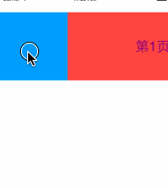

# YRADScrollView
支持循环滚动的控件

---

特点：  
* 支持循环滚动  
* 支持关闭循环滚动  
* 支持重用控件，以节约内存  
* 使用方式较为简单，提供点击和翻页的回调

实现方式：
目前，对于循环滚动有两种：  
1.在头和尾分别增加一个控件，如滚动到结尾时，通过设置contentOffset使得控件位置拉回到开头区域，看起来达到了循环的效果。  
2.设置一大段可滚动区域，把待滚动控件置于可滚动区域的中间，这样左右滚动时，通过页面重用算法，只需要调整页面位置即可实现循环滚动。

本控件采用第二种实现，默认支持1000次完整的循环滚动（一般人不太可能操作那么多次，因此完全满足日常需求，如果不满足，可修改源码增加循环次数）

效果图：  
